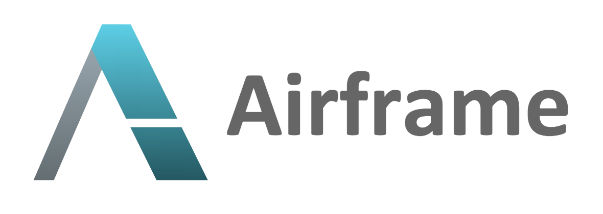

# All in Scala

Team-Q 2020 LT大会
2020.12.25

Kawashima Kazuhisa

---
# 自己紹介
* 名前: 川嶋 一寿
* 職業: プログラマー
* 拠点: 静岡県静岡市
* 趣味: 酒、ジョギング、水泳（最近再開）
* 好きな言語: [Scala](https://www.scala-lang.org/)
* その他活動: 専門学校講師、[Scalapedia](https://scalapedia.com/)の記事執筆
* Twitter: [@cupperservice](https://twitter.com/cupperservice)

---
# 今日のお話
サーバサイドもフロントエンドもすべて __Scala__ で書いてみた話

---
# Scala使ってますか？


---

# [Scala](https://www.scala-lang.org/)とは
「オブジェクト指向」と「関数型」を統合した __マルチパラダイム__ 言語

__マルチパラダイム言語？__

---
# 要するに

オブジェクト指向と関数型の両方の良いとこ取りの言語
Simpleに記述できることが特徴

JavaVM上で動作する言語の一つ
Java言語とは相互に利用可能
JavaVM上で動作する言語は他に以下がある
* Groovy
* JRuby
* Kotlin

---
# フロントエンドの Scala?

私達には [Scala.js](https://www.scala-js.org/) がある！


---
# Scala.jsとは？

AltJSの一つ

ScalaのプログラムをJavaScriptに変換して動作させるもの  
Scalaなのでもちろんコンパイラによる型チェックあり

---


---
# 作ってみた

https://github.com/cupperservice/mydic2

英単語と例題を登録するアプリケーション

---
# システム構成


---
# ディレクトリ構成

```
dev-res     // アプリケーション
+-- client    // フロントエンドのコード
+-- server    // サーバサイドのコード
+-- shared    // フロントエンドとサーバサイドの共通コード
services    // Docker
+-- appsvr    // Applicationサーバ
+-- db        // Databaseサーバ
+-- websvr    // Webサーバ
```

---

# サーバサイドの構成
* Framework: [Playframework](https://www.playframework.com/)
* DIコンテナ: [Guice](https://github.com/google/guice)
* DBアクセス: JDBC


---
# フロントエンドの構成
* Framework: なし
* DOM操作: [scala-js-dom](https://scala-js.github.io/scala-js-dom/)
* [View](https://github.com/cupperservice/mydic2/blob/master/dev-res/server/app/views/index.scala.html)
* [コード](https://github.com/cupperservice/mydic2/tree/master/dev-res/client/src/main/scala/cupper/mydic2)

---
# JSライブラリの呼び出し

JSのライブラリも呼び出すことができる。
```
@js.native
trait SpeechSynthesisVoice extends js.Object {
  val voiceURI: String = js.native
}

@js.native
@JSGlobal
class SpeechSynthesisUtterance(var text: String) extends js.Object {
  var voice: SpeechSynthesisVoice = js.native
}

@js.native
@JSGlobal("speechSynthesis")
object SpeechSynthesis extends js.Object {
  def speak(msg: SpeechSynthesisUtterance): js.Any = js.native
  def getVoices(): js.Array[SpeechSynthesisVoice] = js.native
}
```

---
# 共通コード
サーバとフロントエンドで共通のコードが使える
[コード](https://github.com/cupperservice/mydic2/tree/master/dev-res/shared/src/main/scala/cupper/mydic2)

---
# DOM操作を書くのはめんどくさい
今どきDOMを直接操作する？

モダンなWebフレームワークを使いたい
Reactとか


Vue.jsとか


---
# Scalaで Reactするなら

* [scalajs-react](https://github.com/japgolly/scalajs-react)
* [Slinky](https://slinky.dev/)

---
# Scalaで Vue.jsするなら

ScalaでVue.jsは厳しい。

---
# Airframe?

サーバサイドもフロントエンドの両方をScalaで開発できる[Airframe](https://wvlet.org/airframe/)というものがあるらしい。



---
# Airframeとは

Scalaで開発するための軽量ライブラリの集まり
* Designed for Scala and Scala.js
* RPC Framework
* MessagePack-based Object Serialization
* REST Services
...

---
# 使ってみよう
前述のアプリをairframeを使って書き直してみる
https://github.com/cupperservice/mydic3

---
# ディレクトリ構成
前回と同じような構成

```
app         // アプリケーション
+-- api       // サーバサイドのAPIインターフェース & Valueオブジェクト
+-- server    // サーバサイドのコード
+-- ui        // フロントエンドのコード
services    // Docker
+-- appsvr    // Applicationサーバ
+-- db        // Databaseサーバ
+-- websvr    // Webサーバ
```

---
# 前回との違い1
## クライアント・サーバ間の通信
Airframe RPCを使用して実現する

* 前回: REST API
  JSONの処理が必要

* 今回: Airframe RPC
  API IFを定義するだけ
  どのように通信するかはAirframeまかせ

---
# APIで使用するValueオブジェクトを定義
APIで使用するValueオブジェクトを定義する

```
case class NumOfAllWords(num: Int)
case class DictionaryInformation(numOfWords: Int, history: List[Word])
case class Word(id: Int, text: String, refCount: Int, lastRefTime: DateTime)
case class Example(id: Int, text: String)
case class DateTime(time: Long)
```

---
# APIのインターフェースを定義
@RPCアノテーションを付けてAPIのインターフェースを定義する

```
@RPC
trait MyDicAPI {
  def getInformation(): DictionaryInformation
  def createWordIfNotExists(text: String): Word
  def getExamples(wordId: Int): List[Example]
  def createExample(wordId: Int, example: Example)
  def getHistories(max: Int): Seq[Word]
}
```

---
# APIの実装

```
trait MyDicApiImpl extends MyDicAPI {
  private val service: WordService = bind[WordService]

  override def createWordIfNotExists(text: String): Word = {
    service.createIfNotExist(text) match {
      case Right(word) => word
      case Left(e) => throw e
    }
  }
  ...
```

---
# クライアントからAPIを呼び出す
呼び出し側の実装(ServiceJSClient.MyDicAPI)は、API IFから自動生成される

```
object MyDictionary {
  lazy val client = new ServiceJSClient()

  def findWord(text: String): Future[Word] =
    client.MyDicAPI.createWordIfNotExists(text)

  def getHistories(): Future[Seq[Word]] =
    client.MyDicAPI.getHistories(10)
}
```

---
# 前回との違い2
## APIのルーティング方法
* 前回: Playframework
routeファイルにパスと呼び出すコントローラーの情報を定義する
* 今回: Airframe RPC
API IFの実装をルーターとして使う
---
* Playframework
```
GET         /word                           cupper.mydic2.controllers.WordController.getInformation
POST        /word                           cupper.mydic2.controllers.WordController.createIfNotExist
PUT         /word/:id                       cupper.mydic2.controllers.WordController.update(id:Int)
```
* Airframe
```
val router = Router
  .add[MyDicApiImpl]

val design = newDesign
  .add(Finagle.server
    .withRouter(router)
    .withPort(port)
    .withName("My Dictionary server")
    .design)
```

---
# 前回との違い3
## サービスの注入方法
* 前回: Guice
```
class InfrastructureModule extends AbstractModule {
  override def configure(): Unit = {
    bind(classOf[cupper.mydic2.models.WordRepo]).to(classOf[cupper.mydic2.dao.WordRepo])
  }
}
```
```
@Singleton
class WordController @Inject()(
    cc: ControllerComponents, usecase: cupper.mydic2.models.WordModel) extends AbstractController(cc) {
```

---
# 前回との違い3
## サービスの注入方法
* 今回: Airframe DI
```
val design = newDesign
  .bind[WordService].toInstance(new WordService(new DicRepositoryImpl()))
  .add(Finagle.server
    .withRouter(router)
    .withPort(port)
    .withName("My Dictionary server")
    .design)
```
```
trait MyDicApiImpl extends MyDicAPI {
  private val service: WordService = bind[WordService]
```

---
# 前回との違い4
## HTMLレンダリング
* 前回: DOMを直接操作
```
class EditExampleView(_top: Element) extends Screen(_top) {
  document.getElementById("edit-example-create").asInstanceOf[Button].onclick = (event) =>
    Event.dispatch(Event.ApplyEditExample(Example(exampleId.value.toInt, exampleText.value)))

  val exampleText = document.getElementById("edit-example-content").asInstanceOf[TextArea]

  override def show(data: Data): Unit = {
    val editExample = data.asInstanceOf[EditExampleData]

    exampleText.value = editExample.example.text
  }
}
```

---
# 前回との違い4
## HTMLレンダリング
* 今回: Airframe RX
```
class EditExampleTab extends Page {
  override def render: RxElement = {
    div(cls -> "tab_content",
      examples.map (list.map (e =>
        // textareaの定義
      )),
      button("Apply", onclick -> {e: MouseEvent => {
        // イベント処理
      }}),
    )
  }
}
```
---
# 前回との違い5
## DBアクセス
* 前回: JDBC APIを直接使用
```
  def _find(word: String, connection: Connection): Option[Word] = {
    val stmt = connection.prepareStatement("select * from word where word=?")
    stmt.setString(1, word)
    val rs = stmt.executeQuery()
    if(rs.next()) {
      Some(Word(
        rs.getInt(1),
        rs.getString(2),
        rs.getInt(3),
        rs.getString(4))
      )
    } else {
      None
    }
  }
```

---
# 前回との違い5
## DBアクセス
* 今回: Slick(FRM)を使用
以下の`Word`は、Slickによって自動生成されたコード
```
override def findWords(text: String): Future[Seq[v1.Word]] = {
  withDb(db => {
    val query = Word.filter(w => w.text === text)

    for(list <- db.run(query.result)) yield {
      for(w <- list) yield v1.Word(w.id.toInt, w.text, w.refCount, w.lastRefTime)
    }
  })
}
```
---

# 問題発生
Airframe RXの使い方がよくわからない

* 画面から入力した値を取得する方法が不明
  DOM操作するしかない？
* 動的にリストを作る方法が不明
  ドキュメントやサンプルには記載がないので、試行錯誤したが不明

これだと、DOMを直接操作するコードが増えてしまう

---
# Viewの部分を変更する
Airframe RXは使用せずに以下のどちらかを使用する
* scalajs-react
* Slicky

Airframeのそれ以外の部分は利用する

---
# 冬休みの宿題
アプリケーションを完成するぞ！

---
# Thank you for listening!
