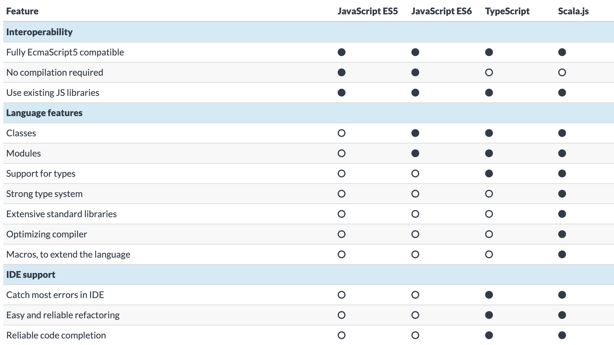
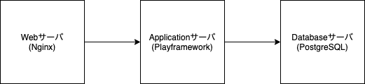
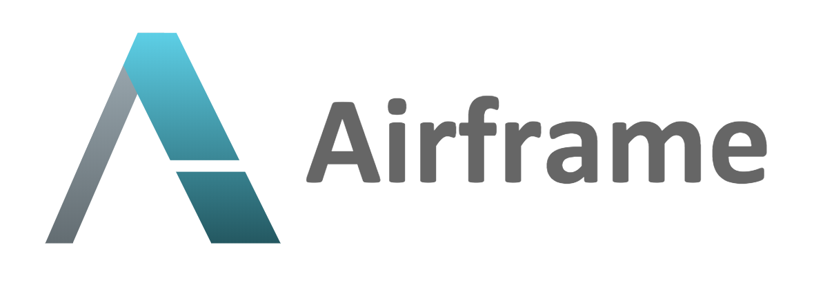

# ぜんぶ Scala でいいじゃん

浜松IT合同勉強会2020 LT大会
2020.12.19

Kawashima Kazuhisa

---

# 自己紹介
* 名前: 川嶋 一寿
* 職業: プログラマー
* 所属: [株式会社ゆめみ](https://www.yumemi.co.jp/)
* 拠点: 静岡県静岡市
* 趣味: 酒、ジョギング、水泳（最近再開）
* その他活動: 専門学校講師、[Scalapedia](https://scalapedia.com/)の記事執筆
* Twitter: [@cupperservice](https://twitter.com/cupperservice)

---

# 今日のお話
サーバサイドもフロントエンドもすべて __Scala__ で書いてみた話

---

# Scala使ってますか？

---

# [Scala](https://www.scala-lang.org/)とは
「オブジェクト指向」と「関数型」を統合した __マルチパラダイム__ 言語

__マルチパラダイム言語？__

---

# 要するに

オブジェクト指向と関数型の両方の良いとこ取りの言語
Simpleに記述できることが特徴

JavaVM上で動作する言語の一つ
Java言語とは相互に利用可能
JavaVM上で動作する言語は他に以下がある
* Groovy
* JRuby
* Kotlin

---

# フロントエンドの Scala?

私達には [Scala.js](https://www.scala-js.org/) がある！


---

# Scala.jsとは？

AltJSの一つ

ScalaのプログラムをJavaScriptに変換して動作させるもの  
Scalaなのでもちろんコンパイラによる型チェックあり

---



---

# 作ってみた

https://github.com/cupperservice/mydic2

---

# システム構成



---

# ディレクトリ構成

```
dev-res     // アプリケーション
+-- client    // フロントエンドのコード
+-- sercer    // サーバサイドのコード
+-- shared    // フロントエンドとサーバサイドの共通コード
services    // Docker
+-- appsvr    // Applicationサーバ
+-- db        // Databaseサーバ
+-- websvr    // Webサーバ
```

---

# サーバサイドの構成

---

# フロントエンドの構成

---

# 共通コード

---

# DOM操作を書くのはめんどくさい
今どきDOMを直接操作する？

モダンなWebフレームワークを使いたい
Reactとか


Vue.jsとか


---
# Scalaで Reactするなら

* [Slinky](https://slinky.dev/)
* [scalajs-react](https://github.com/japgolly/scalajs-react)

---
# Scalaで Vue.jsするなら

---

# Airframe?

https://wvlet.org/airframe/


---

# 作ってみた

https://github.com/cupperservice/mydic3

---

# ディレクトリ構成

---

---

---

# Thank you for listening!
